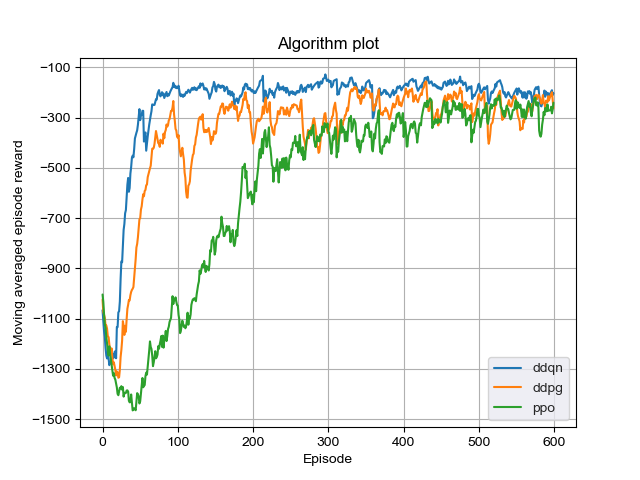
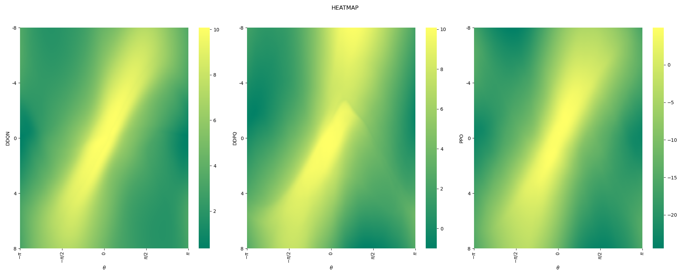

# Reinforcement Learning Methods with PyTorch
Try different reinforcement learning methods with PyTorch on the OpenAI Gym! All the algorithms are validated on Pendulum-v0.

## Requirement
To run the code, you need:
- torch 0.4
- gym 0.10

## Method
There are four versions of algorithms realized:
- DDQN with discretized action space
- DDPG with continuous action space
- PPO with discretized action space
- PPO with continuous action space
Note that in PPO using value function to estimate advantages, which is different from the original one.

## Result
The moving averaged episode rewards are shown as below:

The heatmaps of value and action are shown as below:

The variance of value and action are shown as below:

From the results, we find that value-based algorithums are data-efficient for they are off-policy. Discretized action space is easier to train but the result looks
ugly (trembling).  

## Reference
